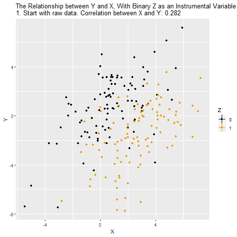
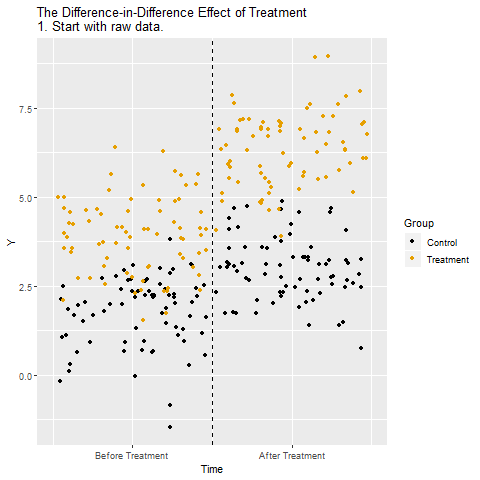
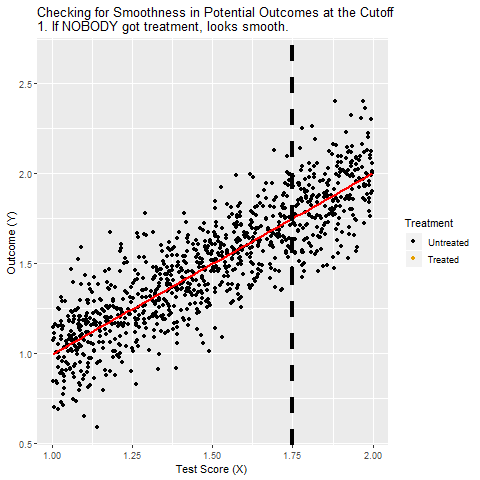

# (PART) Natural Experiments {-}

# Natural Experiments

## Finding Experiments in Nature

## Instrumental Variables

```{r, eval=TRUE, echo=FALSE}
if (knitr:::is_latex_output()) {
  knitr::asis_output('\\url{http://nickchk.com/anim/Animation%20of%20IV.gif}')
} else {
  
}
```

## Difference-in-Differences

```{r, eval=TRUE, echo=FALSE}
if (knitr:::is_latex_output()) {
  knitr::asis_output('\\url{http://nickchk.com/anim/Animation%20of%20DID.gif}')
} else {
  
}
```

## Regression Discontinuity

```{r, eval=TRUE, echo=FALSE}
if (knitr:::is_latex_output()) {
  knitr::asis_output('\\url{NOLINKYET}')
} else {
  
}
```
