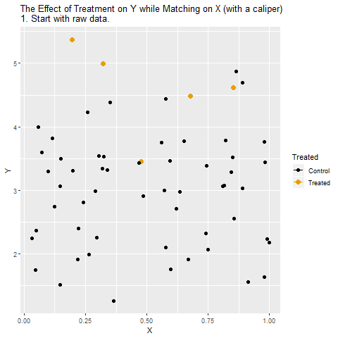

# (PART) Observational Methods {-}

# The Purpose of Observational Methods

In the previous chapter on [Randomized Controlled Trials]('03_RCT.html'), we showed that, by randomizing treatment, we could identify causal effects because the random variation sidestepped the impact of omitted variables or sample selection that could drive a non-causal correlation between treatement and outcome. In [Natural Experiments]('04_NE.html'), we mimicked that strategy by finding sources of near-random variation in treatment, and isolating the part of treatment that was driven by the near-random variation.

Using Randomized Controlled Trials or Natural Experiments, if they are properly applied, it is possible to ignore *any* confounding variables, whether or not we can measure them in our data or even imagine what they are.

However, it is not always possible to run an experiment or find a natural experiment. In this chapter, we will consider ways of identifying causal effects using *Observational* methods, relying only on the data we have actually collected and observed. Natural Experiments often make use of additional Observational methods, correcting for confounding variables that the design of the natural experiment cannot account for.

This chapter contains four sections: the first two cover multiple regression and matching, respectively, which are two common ways of adjusting for observed variables. The third covers the sufficient adjustment set, which allows you to determine which variables should and should not be adjusted for to identify a causal effect. The fourth covers fixed effects, which is a method that allows you to adjust for some unmeasured confounding variables.

## Multiple Regression

```{r, eval=TRUE, echo=FALSE}
if (knitr:::is_latex_output()) {
  knitr::asis_output('\\url{http://nickchk.com/anim/Animation%20of%20Control.gif}')
} else {
  knitr::include_graphics("animations/Control.gif")
}
```


## Matching

```{r, eval=TRUE, echo=FALSE}
if (knitr:::is_latex_output()) {
  knitr::asis_output('\\url{http://nickchk.com/anim/Animation%20of%20Matching.gif}')
} else {
  
}
```

## Sufficient Adjustment Set

## Fixed Effects

### Between and Within Variation

Fixed effects is a method that can be applied when you have *panel data*: multiple observations of the same individual over time.

When you have multiple observations per individual, variation in the outcome variable $Y$ comes from two places: *between variation* and *within variation*. Between variation is the difference *between* individuals in their average level of $Y$. Within variation is the difference *within* a given individual comparing one time period to another.

For example, consider the below data.

```{r, eval=TRUE, echo=FALSE}
knitr::kable(data.frame(Person = c('Anna','Anna','Bill','Bill'),
                        Time = c(1,2,1,2),
                        Y = c(4,8,3,1),
                        D = c(0,1,1,0)),
             caption='Y over Two Time Periods for Two People')
```

Anna's average $Y$ is `(4+8)/2 = 6`, and Bill's average is `(3+1)/2 = 2`. The difference between the `6` and the `2` is the difference *between* Anna and Bill. And Anna's change from 4 to 8, and Bill's change from 3 to 1 are the differences *within* Anna and Bill.

Fixed effects eliminates *all* between variation and uses only within variation. In effect, you are *controlling for individual identity*. For this reason it is also known as the "within estimator".

The reason fixed effects does this is that it in effect controls for *all* differences between people that are constant across time, whether or not we control for them. 

### Demonstration of Fixed Effects

Fixed effects works by simply removing all the between variation in each variable before performing an analysis of choice.

Using the above example with Anna and Bill, we can subtract all between variation in $Y$ and $D$ by calculating the average of $Y$ and $D$ for Anna and Bill, separately, and subtracting it out. Notice that $\bar{Y}_{Anna}=6, \bar{Y}_{Bill}=2, \bar{D}_{Anna}=.5, \bar{D}_{Bill}=.5$.

```{r, eval=TRUE, echo=FALSE}
knitr::kable(data.frame(Person = c('Anna','Anna','Bill','Bill'),
                        Time = c(1,2,1,2),
                        Y = c(4,8,3,1),
                        D = c(0,1,1,0),
                        Within.Y = c(-2,2,1,-1),
                        Within.D = c(-.5,.5,.5,-.5)),
             caption='Within Variation in Y and D')
```

With this modified data, the relationship between `Within.Y` and `Within.D` will tell us about the effect of `D` on `Y`, as long as all confounding variables were a part of the between variation.

This process is demonstrated in animation below.

```{r, eval=TRUE, echo=FALSE}
if (knitr:::is_latex_output()) {
  knitr::asis_output('\\url{http://nickchk.com/anim/Animation%20of%20Fixed%20Effects.gif}')
} else {
  knitr::include_graphics("animations/FixedEffects.gif")
}
```

### Fixed Effects with Regression

Fixed effects estimation is usually performed using regression. In the below model, each individual $i$ has their own intercept $\alpha_{i}$. 

\begin{align}
  Y_{it} = \alpha_i + \beta D_{it} + \varepsilon_{it} (\#eq:fe1)
\end{align}

where $\varepsilon_{it}$ is an error term. This can also be seen as a regression of $Y_{it}$ on $D_{it}$ and a series of binary variables, one for each individual.

\begin{align}
  Y_{it} = \alpha + \sum_{i=0^N}\alpha_iI(i) + \beta D_{it} + \varepsilon_{it} (\#eq:fe2)
\end{align}

where $I(i)$ is a function equal to 1 for individual $i$ and 0 otherwise.

Either Equation \@ref(eq:fe1) or Equation \@ref(eq:fe2) will provide identical estimates of $\beta$ as though you had run the regression

\begin{align}
  Within.Y_{it} = \alpha + \beta Within.D_{it} + \varepsilon_{it} (\#eq:fe3)
\end{align}

Any variable that is *constant within individual* will be controlled for using fixed effects, whether or not it is measured. For example, imagine that $i$ is an index of people, $D_{it}$ is being exposed to a pollution-reduction policy, and $Y_{it}$ is a measure of health. The variable $G_i$ measures a genetic endowment at birth, which may affect health and also whether you live in the area with the policy. Notice that $G_i$ does not have a $t$ subscript, indicating that it is *constant over time* for each person. Even without measuring $G_i$, it will be controlled for, since $G_i$ is just $I(i)$ multiplied by some constant, and we're already controlling for $I(i)$.

Equation \@ref(eq:fe2) also makes clear that we are not controlling for anything that varies within person over time. For example, $Inc_{it}$ is income, which may affect health, and also whether you can afford to live in the area with the policy. Fixed effects alone does not control for $Inc_{it}$, and so we may need to add it as a control.

Similarly, fixed effects assumes that identity has a linear and constant effect. For example, if genetic endowment $G_i$ has a stronger effect in some years than others, fixed effects will not account for this. Or, if genetic endowment modifies how effective the policy is, fixed effects will not account for this unless $G_i$ can be measured and the nonlinearity can be directly modeled.

However, if all confounding variables are between-individual, linearity holds, and several other assumptions hold (see Treatment Effect Heterogeneity below), then fixed effects will identify the Average Treatment Effect.

Notice that the modeling in this section is very similar to *Random Effects*, not addressed in this chapter, which are similar to fixed effects but combine both between and within variation.

### Common Extensions

#### Clustered Standard Errors

The standard approach to calculating standard errors for Equations \@ref(eq:fe1), \@ref(eq:fe2), or \@ref(eq:fe3) makes the assumption that the error term $\varepsilon_{it}$ is independent and identically distributed. However, it may be reasonable to assume that $\varepsilon_{it}$ is correlated within individual. 

Under this condition, standard errors will be underestimated. For this reason, it is common to estimate fixed effects regressions using clustered standard errors. See [Cameron & Miller 2013](http://cameron.econ.ucdavis.edu/research/Cameron_Miller_Cluster_Robust_October152013.pdf) (or the published version [Cameron & Mill 2015](http://jhr.uwpress.org/content/50/2/317.short)) for a practitioner's guide to whether clustering is necessary in a given fixed effects context, and how it can be performed.

#### Two-Way Fixed Effects

In many fixed effects contexts, some of the within variation in $Y_{it}$ may not just be specific to person $i$, but may be shared across all individuals. For example, if the sample includes many individuals in the same economy, the overall health of the economy changes over time and would affect everyone. If the treatment variable $D_{it}$ is correlated with time as well, then these shared time effects will bias our estimate of the causal effect.

In cases like this it is common to include two sets of fixed effects - one for individual, $\alpha_i$, and one for time, $\alpha_t$. The regression equation is then

\begin{align}
  Y_{it} = \alpha_{i} + \alpha_{t} + \beta D_{it} + \varepsilon_{it} (\#eq:fe4)
\end{align}

#### Treatment Effect Heterogeneity

Under the assumptions discussed above, the estimate produced by a fixed effects regression will be a weighted average of the treatment effect for each individual. To see this, consider a data set that has only two time periods in it, and each individual is treated in exactly one of these periods, like our example above:

```{r, eval=TRUE, echo=FALSE}
knitr::kable(data.frame(Person = c('Anna','Anna','Bill','Bill'),
                        Time = c(1,2,1,2),
                        Y = c(4,8,3,1),
                        D = c(0,1,1,0),
                        Within.Y = c(-2,2,1,-1),
                        Within.D = c(-.5,.5,.5,-.5)),
             caption='Within Variation in Y and D')
```

Anna sees an increase of 4 when the treatment is applied, and Bill sees an increase of 2. The fixed effects estimate will be `(2+1)/2 - (-2 + -1)/2 = 1.5 - -1.5 = 3`, which is also `(4+2)/3 = 3`, the average treatment effect in the sample.

In this case, Anna and Bill received equal weight. That is because Anna and Bill had the exact same amount of variation in $D$. Fixed effects will more heavily weight individuals with more variation in $D$. For example, imagine that Bill always has $D = 0$ and thus no variation in $D$:

```{r, eval=TRUE, echo=FALSE}
knitr::kable(data.frame(Person = c('Anna','Anna','Bill','Bill'),
                        Time = c(1,2,1,2),
                        Y = c(4,8,1,1),
                        D = c(0,1,0,0),
                        Within.Y = c(-2,2,0,0),
                        Within.D = c(-.5,.5,0,0)),
             caption='Within Variation in Y and D, where Bill Always Has D = 0')
```

The fixed effects estimate is now `2 - -2 = 4`, which is Anna's treatment effect. Bill has no variation in $D$ and thus receives no weight. We have failed to estimate the Average Treatment Effect.

One way to adjust for this is to use weighted least squares, where each observation is weighted by the inverse standard deviation of treatment within individual $(\sigma^D_i)^{-1}$, where

\begin{align}
  \sigma^D_i = (\sum_t(D_{it} - \bar{D}_i)^2)^{1/2} (\#eq:fe5)
\end{align}

While this will not account for observations with no variation in $D_{it}$, this will otherwise recover the average treatment effect ([Gibbons, Serrato, & Urbancic, 2018](https://www.degruyter.com/view/j/jem.2019.8.issue-1/jem-2017-0002/jem-2017-0002.xml)).

### Coding Up Fixed Effects

Each of the following coding examples uses `D` as a treatment variable of interest, `Y` as the outcome variable, `id` as a variable encoding the individual, and `t` as a variable with the time period. In the R examples, all variables are stored in the data frame `df`.

Fixed effects is easy to implement using regression by simply including a set of dummy variables, one for each individual. This method can be implemented as:

```{r, echo=TRUE, eval = FALSE}
#in R:
fe <- lm(Y~D+factor(id), data = df)
summary(fe)

#in Stata:
regress Y D i.id
```

Many statistics packages also allow you to identify the panel structure of the data, and have a specific command for implementing fixed effects.

```{r, echo=TRUE, eval = FALSE}
#in R:
library(plm)
df.p <- pdata.frame(df,index=c("id","t"))
fe <- plm(Y~D,data=df.p,model="within")
summary(fe)
#Add clustered standard errors
library(lmtest)
fe.cluster <- coeftest(fe,vcov=vcovHC(model,type = "HC1", cluster="group"))
summary(fe.cluster)

#in Stata:
xtset id t
xtreg Y D, fe
#Add clustered standard errors
xtreg Y D, fe vce(cluster id)
```

Two-way fixed effects can be handled, as normal, by adding dummy variables for time period. There are also more formal ways of handling two-way fixed effects that work more quickly or handle standard errors in a more accurate way.

```{r, echo=TRUE, eval = FALSE}
#in R:
#Just using dummies
fe <- lm(Y~D+factor(id)+factor(t), data = df)
#Using PLM
library(plm)
df.p <- pdata.frame(df,index=c("id","t"))
fe.twoways <- plm(Y~D,data=df.p,model="twoways")
summary(fe.twoways)

#in Stata:
#Using dummies and xtreg
xtset id t
xtreg Y D i.t, fe
#Using reghdfe
ssc install reghdfe
#You may also have to install gtools
#and in some cases do "reghdfe, compile" before use
reghdfe Y D, absorb(id t)
```
